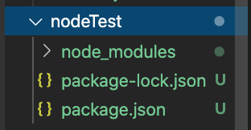
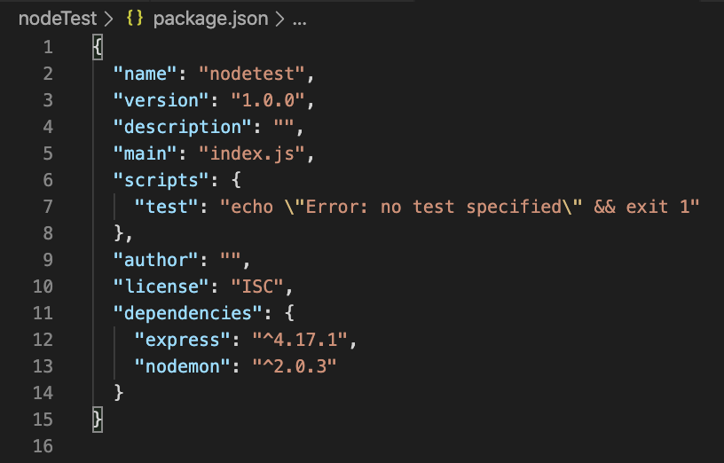
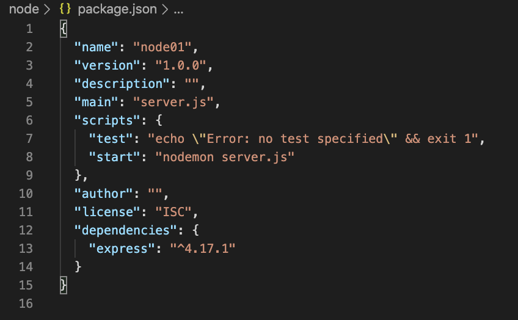

오늘은 노드의 설치환경을 만들고, 서버를 열고 닫고 하는 일련의 과정을 배우게 되었다.


# 설치 과정

먼저 터미널을 통해 노드를 생성하고, 필요한 패키지들을 설치하는 과정이다.

- **새로운 노드를 실습할 폴더를 생성해 준다.**

  ```
  $ mkdir 폴더명
  ```

- **새로운 노드를 생성해 준다.**

  ```
  $ npm init
  ```

- **express를 설치한다.**

  ```
  $ npm install express
  ```

- **nodemon을 설치한다.(intall은 i로 줄일 수 있고, --global은 -g로 줄일 수 있다.)**

  ```
  $ sudo npm i -g nodemon
  ```

- **위의 과정들을 거치고 vsCode에서 해당 파일을 열어보면 이러한 폴더들이 생겼다.**

   

- **package.json파일로 들어가보면 이러한 내용들이 담아져있다.**

  

  가장 아래에 dependecies에는 우리가 설치한 `express`와 `nodemon`이 추가되어있는 모습을 볼 수 있다. 

  노드몬은 소스를 수정할 때마다 서버를 알아서 재시작 해주는 패키지이다. 노드몬을 작성했다면 `"scripts"`부분을 아래와 같이 수정해주자.

  

  이렇게 수정해 놓으면, npm start를 할 때마다 서버만 키는 것이 아닌, 노드몬으로 서버를 켜주기 때문에 노드몬이 소스를 수정할 때마다 알아서 서버를 재시작 해준다.

# 서버 생성

이제 노드가 생성되어 있으니, 이 곳에 js파일을 통해 서버를 생성해 보자.

- **해당 폴더에 `server.js`파일을 만들고, 아래와 같이 내용을 담아준다.**

  ```jsx
  const http = require("http"); // http 모듈을 import한다고 생각하면 된다.
  const app = require("./app"); // 나중에 app이라는 모듈을 만들 예정이라 app파일을 import하는 것 이다. 여기서 js확장자는 생략이 가능하므로, ./app으로 작성하였다.
  
  const server = http.createServer(app); //http라는 요청을 받으면 app이라는 모듈을 실행한다는 뜻 이다. 그리고 그것을 변수 server로 담았다.
  
  server.listen(8000, () => {
    console.log("서버열림");
  });
  // 위의 8000이라는 서버 요청을 받게 되면, 서버를 열어주며 app이라는 모듈을 실행할 예정이다.
  
  ```

- **해당 폴더에 `app.js`파일을 만들고, 아래와 같이 내용을 담아준다.**

  ```jsx
  const express = require("express"); // express란 모듈을 import한다.
  const app = express(); // express 모듈 실행
  
  app.get("/user/:id/:name", (req, res, next) => {
    console.log("id", req.params);
    res.json({
      query: req.query,
      params: req.params,
      url: req.url,
    });
  });
  
  module.exports = app; // 해당 모듈을 app이라고 exports해준다. 다른 곳에서 해당 모듈을 app으로 import할 수가 있다.
  
  ```

  위에 예시에서는 get에 대한 요청처리를 하는 모습이다.

  get 함수 안에 인자로 `"/user/:id/:name"`를 써주는 것은 사용자가  `http://localshost:8000/user/무언가01/무언가02`를 주소에 입력하게 되면, 우리는 해당 주소에서 `무언가01`을 `id`로 변수처리하게 되고, `무언가02`를 `name`으로 변수처리를 한다는 내용이다.

  두번째 인자로 `(req, res, next)`에서 Req는 요청을 뜻하고, res는 응답을 뜻 한다.

  그다음 함수 안에 `res.json({})`은 사용자에게 `"/user/:id/:name"` 이러한 형태로 요청을 받으면 `res.json({})` 함수 안에 내용으로 응답을 하겠다는 뜻 이다.

  우리는 요청 받은 값이 정확한지 `req.query`, `req.params`, `req.url`로 되 받아치는 모습을 볼 수 있다.

