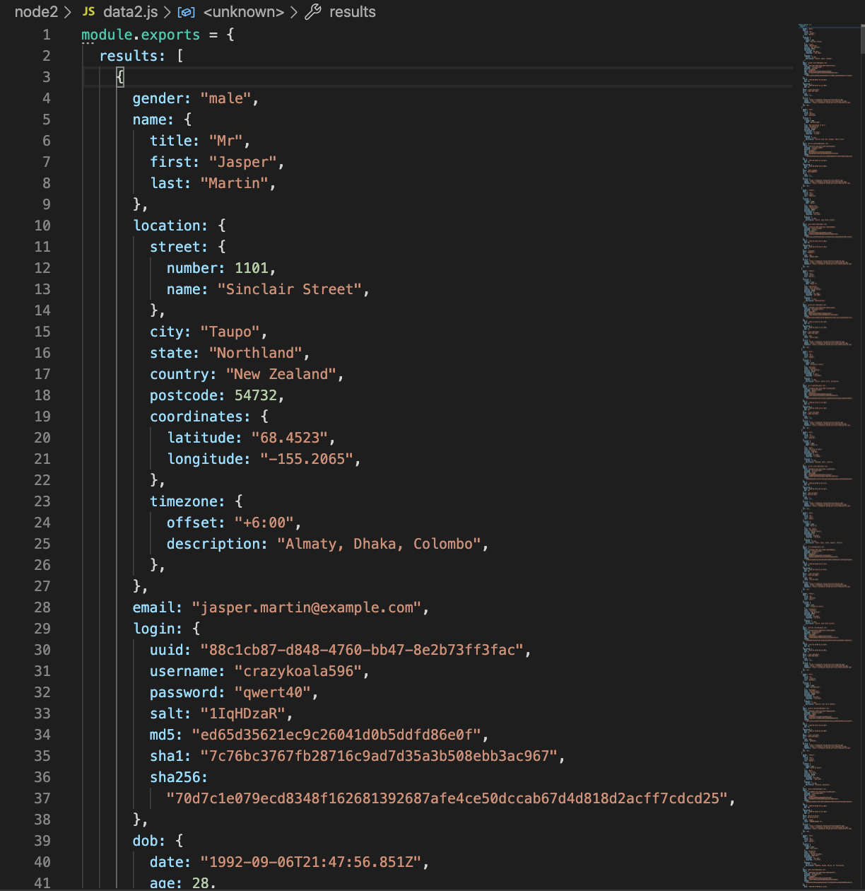
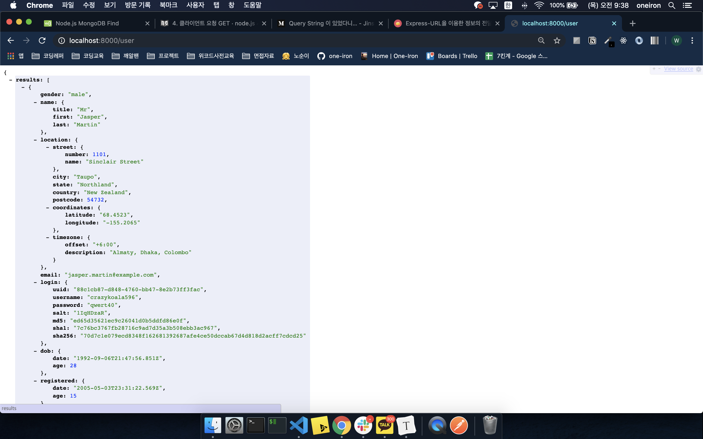

# 복습 과정

배운것이 뭐가 있다고 복습이라고 하겠지만, 사실 사람들도 오랜 시간이 지나면 서로를 알게되고 익숙해져서 대화하기가 편하다. 하지만 어떤 사람을 처음 만나면 그렇게 편하지도 익숙하지도 혹은 상대방에 대해 모르는 것이 많기 때문에 사소한 것으로 실수를 할 수 도 있다.

만약 누구는 대화를 할 때 큰 소리를 내서 이야기하는 것을 소음으로 생각하고 찡그릴 수 도 있다고 가정해보면 그 사람이 그것을 불편하다고 알기 까지 많은 시간이 걸릴 것 이다. 그렇기 때문에 그 사람이 나에게 정말 중요한 사람이라면 그 사람과의 이야기를 되내이며 그 사람의 감정을 살펴 볼 필요가 있다. 중요한 그 사람에게 실수를 하지 않기 위해서 말이다.

`나는 node.js가 불편해 하는 것이 무엇인지 알 필요가 있다.`라고 쓰고 `머리가 나빠서 별거 아닌 것도 복습한다` 라고 읽는다. (😎~~데헷 머쓱머쓱 머쓱타드~~)

### 열려있는 서버 강제 종료

우선 복습을 하려는데 어디 선가 8000포트로 서버가 열려있어서

```
[nodemon] app crashed - waiting for file changes before starting...
```

서버를 열려고 하면 위와 같이 오류가 발생하였고 구글링 결과 아래와 같이 터미널에 작성해 주면 열려있는 서버를 강제 종료 시킬 수 가 있었다.

```
pkill -f node
```


### Common Js 모듈 사용법

Node.js에서는 모듈을 입력하는 방식은 아래와 같다.

```jsx
const http = require("http")
const app = require("./app")
const server = http.createServer();

server.listen(8000)
```


### Express 기반 Node.Js 서버 키고 끄기

`express`는 웹 애플리케이션, API 개발을 위해 설계되었다. Node.js의 사실상의 표준 서버 프레임워크로 불리고 있다.

```jsx
const express = require("express"); // express란 모듈을 가져온다.
const app = express(); // express 실행
```


### NodeMon 이란?

`소스 수정시 자동으로 서버를 재시작 해주는 것`


# 목데이터를 불러와 보자

복습은 이 정도만 하고, 오늘은 목데이터를 통해 데이터를 가져오고 응답해주는 실습을 하였다. 굉장히 단조로운 실습이지만 원래 처음은 더딘 법...😢 더 빨리 나가고 싶지만... 화이팅하자!

- **해당 폴더에 data파일을 만든다. 아래와 같은 형식이니 참고하기 바랍니다.**

  

  주의할 점은 `module.exports`로 감싸주어야지 해당파일을 내보낼 수가 있다.

- **그리고 app파일로 가서 특정한 요청이 들어올 때, 응답으로 데이터를 보내는 연습을 해보자.**

  ```jsx
  const express = require("express");
  const app = express();
  const data = require("./data");
  
  app.get("/user", (req, res, next) => {
    res.json(data);
  });
  
  module.exports = app;
  
  ```

  위와 같이 작성하였고, 서버를 웹브라우저에 열고, `http://localhost:8000/user`라고 치면 요청을 받아 응답으로 data들을 브라우저에 표시해준다.

  

  음 다행이 생각처럼 진행이 되었네요. 

---

### 오늘의 과제

- 데이터에 있는 유효한 username을 입력창에 쿼리값으로 넘겨주면, 해당 username정보들을 웹브라우저에 띄우기!
- 위에 것을 완료하면, 없는 username을 입력하였을 때에는 없는 메세지를 보여주기!