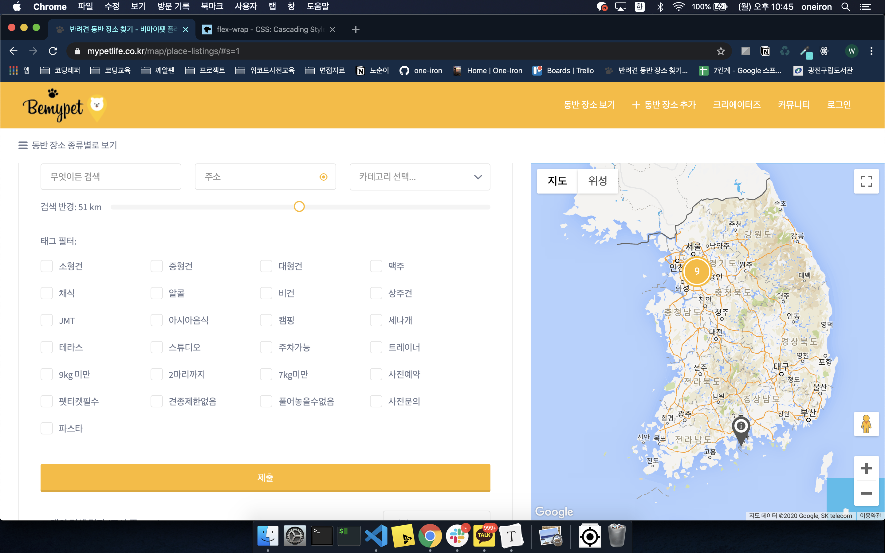
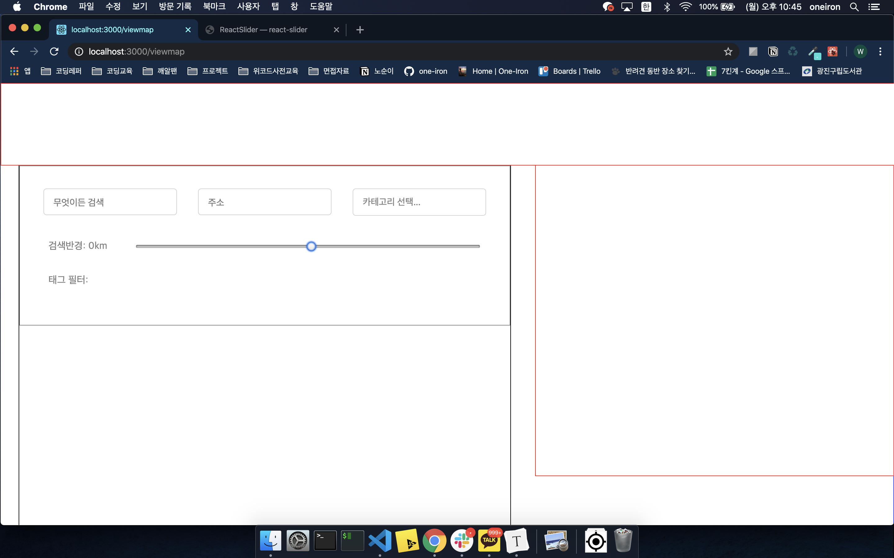

오늘은 드디어 프로젝트를 시작하는 첫 날이었다. 오전에 멘토님들께서 초기셋팅 및 해당 홈페이지에 대해 어떻게 작업해야하는 지를 대략적으로 알려 주었다. 내용들은 아래와 같다.

---

### 주요업무분담

- 주요 기능이 담겨져 있는 페이지 위주로 하는 것이 맞을 것 같다. 추가적으로 백엔드 쪽에서 어떤 API를 만드는지 확인 후, 해당 페이지를 먼저 작업해주는 것이 좋다. 이유로는, 백엔드와의 데이터 교류가 잘 되는지 확인해야 하기 때문에 백엔드와 소통후 같이 나가는 것이 좋다.
- 현재 비마이펫의 주요기능은 아래와 같다.
  - 장소 찾기 기능
  - 로그인, 회원가입 기능
  - 장소 추가 기능
- 기능이 없더라도 우선 구현은 하자. 예를들어 커뮤니티, 크리에이터즈와 같이 우선 구현하는 쪽으로 하는 것이 좋을 것 같다.

### 트렐로

- **Backlog**

  백로그는 2주안에 해야할 모든 일을 적는 곳 이다. 각 페이지의 스타일링 혹은 기능을 하나하나 적어야 하고, 백로그의 일들이 모드 완성되어을 시 홈페이지 클론은 끝이 나야 한다. 즉, 우리가 2주간 해야할 모든 일이 있는 곳!

- **thisweek**

  thisweek는 말그대로 이번주에 내가 해야할 일

- **in-progress**

  내가 하고 있는 일

---

우선 프론트앤드 3명이서 사다리를 타면서 자신이 해야할 페이지를 나누었는데, 서로 맡은 페이지를 할 수 있을까 고민이 많았고, 멘토님께 문의를 하여 결국에는 멘토님께서 생각하시는대로 다시 페이지를 나누어 주었다. 우선 나는 비마이펫의 장소보기 쪽 페이지를 담당하게 되었다.

우리팀은 첫 스타트부터 어려웠다. 깃헙 초기 셋팅이 계속 문제가 생겼고, 셋팅이 완료되자 내가 맡은 페이지를 하려 하는데, 리액트에서 input range의 값을 어떻게 가져오는지 구글링을 하다 포기를 했다.

현재까지도 모르고, 값을 가져오는 것은 차후 다시 하기로 하고 끝냈다.

---

아직 갈 길이 너무 멀지만 내일은 좀 더 발전하고 빨리 다른 페이지들도 클론을 해야겠다. 내일은 꼭 가장 먼저 오자!

**정리해야할 내용들 좋게 말 할때 제발 좀 하자 원철아 ^^ 하...**

- **전개연산자**
- **로그인**(2순위)
- **스크럼**(3순위)
- **포스트맨**(3순위)
- ~~**트렐로**~~
- ~~**몬스터 카드**(1순위)~~

