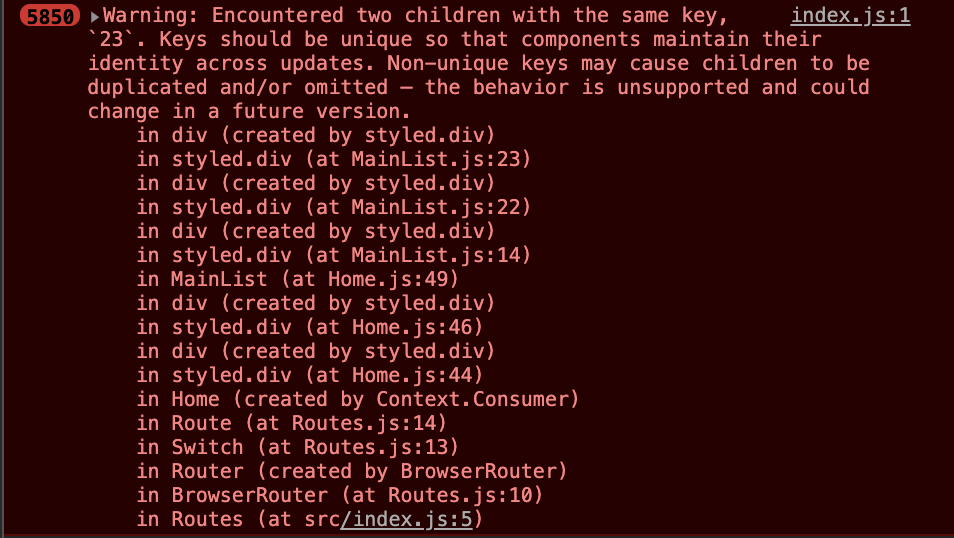

# 무엇을 하였니?

- 2차 프로젝트 메인화면 스타일링

# 무엇을 배웠니?

- ### Two children with the same key in React 오류

  말 그대로 어떠한 키 값이 중복되는 오류이다. 처음에는 작동은 잘 되길래 무심코 지나갔는데 시간이 지나면 지날수록 오류의 증가속도와 갯수가 무한정으로 늘어나는 사태를 아주 뒤늦게 알게 되었다.

  

  우선 map을 활용 한 곳으로 가보았지만 나는 key값을 잘 전달 하고 있었다. 물론 데이터로 받은 id값을 주었는데 그렇게 하지않고 map 두번째 인자를 만들어주었고 그 index값을 key값에 넣어주니 바로 해결되었다.

- 

**정리해야할 내용**

- **매일 타이포라를 열어 모든 오류와 해결법을 적는 습관을 들이자**

- **전개연산자**
- **로그인(2순위)**
- **스크럼(3순위)**
- **포스트맨(3순위)**
- **데이터 구조 모두 정리하기(1순위)**
- **클릭 중복 방지 해결 방법**
- **목데이터 관리 방법**
- **css first type of**
- **config 활용 방법**
- **Hook 세세하게 공부해보자**

