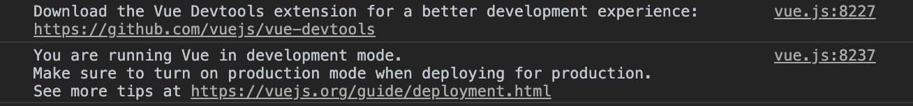
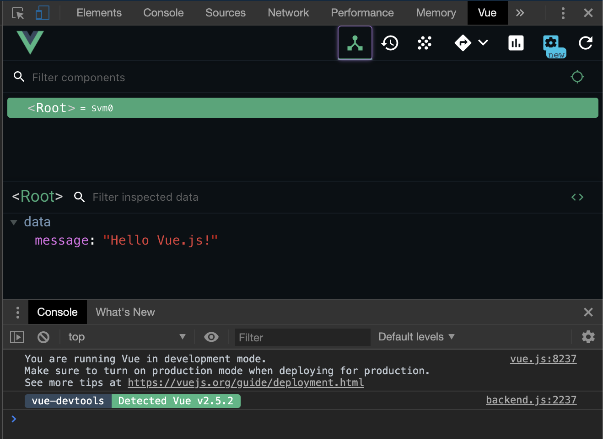
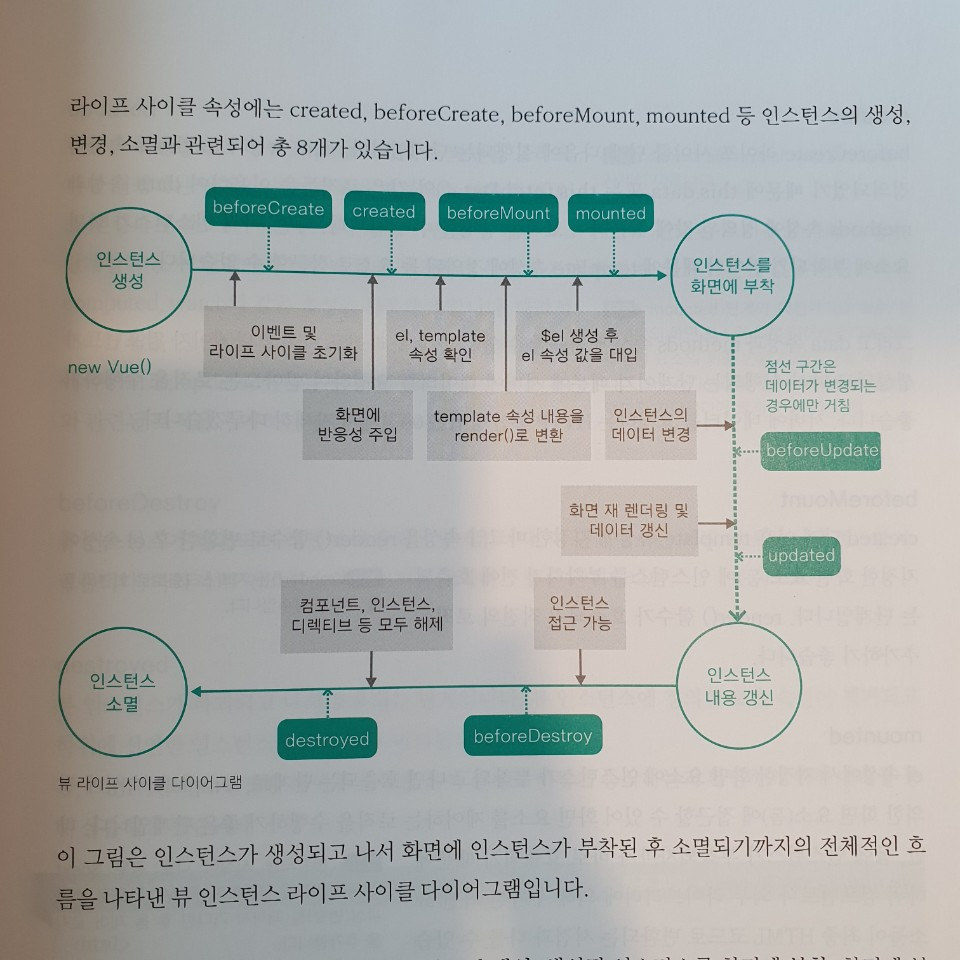

# 무엇을 하였니?

- Vue.js를 처음 배우기 시작했습니다.


# 무엇을 배웠니?

- ### Vue.js 출력하기

  vue.js 입문책 34페이지에 있는 내용을 구현하는데 계속 책처럼 되지를 않아. 구글링, 스택오브플로우를 돌아다니다가 가장 근본적인 문제가 아닐까 생각했다. 바로 `오타` 그렇다. 오타였다.
  
  ```jsx
  <html>
    <head>
      <title>Vue Sample</title>
    </head>
    <body>
      <div id="app">
        {{message}}
      </div>
      <script src="https://cdn.jsdelivr.net/npm/vue@2.5.2/dist/vue.js"></script>
      <script>
        new Vue({ el: "#app", data: { message: "Hello Vue.js!" } });
      </script>
    </body>
  </html>
  
  ```
  
  우선 위 내용은 알맞게 수정한 내용이고, 이렇게 작성하면, new Vue객체안에 있는 메세지 내용이 표현되었다. 아마 뷰를 따로 설치하지 않고 적용한 내용 같았다.
  
- ### Vue Chrom Extension setup

  

  아마 뷰를 처음 실행하면 개발자 도구에서 위 2개의 내용의 경고를 볼 수 있다.

  첫번째 경고는 뷰 크롬 익스텐션을 다운로드하라는 로그이며, 두번째 경고는 현재 개발자 모드에서 뷰를 실행하고 있으니, 상용화된 서비스를 하는 경우에는 상용화 모드로 전환하라는 로그이다.

  이럴때에는 첫번째는 확장프로그램 vue.js devtools를 설치하고, 세부정보에서 url을 허용해주면 해결이 된다.

  

  그 뒤에 개발자 도구를 살펴보면 위 사진과 같이 Vue탭이 생성되고 눌러보면 vue에 관한 정보들을 볼 수 있게 된다.

- ### Vue.js 라이프 사이클

  

- ### Vue.component (전역 컴포넌트)

  ```jsx
  <html>
    <head>
      <title>Vue Sample</title>
    </head>
    <body>
      <div id="app">
        <button>컴포넌트 등록</button>
        <my-component></my-component>
      </div>
  
      <script src="https://cdn.jsdelivr.net/npm/vue@2.5.2/dist/vue.js"></script>
      <script>
        Vue.component("my-component", {
          template: "<div> 전역 컴포넌트가 등록되었습니다!</div>",
        });
        new Vue({ el: "#app", data: { message: "Hello Vue.js!" } });
      </script>
    </body>
  </html>
  
  ```

- ### Components (지역 컴포넌트)

  ```jsx
  <div id="app">
        <button>컴포넌트 등록</button>
        <my-component></my-component>
        <my-local-component></my-local-component>
  </div>
  
  
  let cmp = {
          template: "<div> 지역 컴포넌트가 등록되었습니다!</div>",
  };
  
  
  new Vue({
          el: "#app",
          data: { message: "Hello Vue.js!" },
          components: {
            "my-local-component": cmp,
          },
  });
  ```

  지역 컴포넌트는 전역 컴포넌트와 달리 new Vue 객체 안에 새롭게 인스턴스를 생성하여 선언한다. 이때 new Vue의 객체가 복잡해질것 같으면 위의 예제처럼 변수로 지정해서 사용하여도 가능하다.
  
- ### Vue.js에서는 데이터 전달 형식을 모두 버스로 하는지?

**정리해야할 내용**

- **매일 타이포라를 열어 모든 오류와 해결법을 적는 습관을 들이자**
- **노경모님 강의 정리하기**
- **전개연산자**
- **로그인(2순위)**
- **스크럼(3순위)**
- **데이터 구조 모두 정리하기(1순위)**
- **클릭 중복 방지 해결 방법**
- **목데이터 관리 방법**
- **css first type of**
- **config 활용 방법**
- **Hook 세세하게 공부해보자**
- **리덕스 정리하자**
- **준영님 코드 이해하기**
