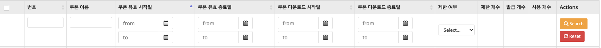

#### 👨🏻‍💻 오늘 무엇을 하였니?

- 쿠폰관리 페이지 정렬 버그 수정
- OKR 작성
- Sortable.mixin.js 함수 수정 시작

#### 👨🏻‍🎓 오늘 무엇을 배웠니?

- #### 쿠폰관리페이지 정렬 버그 수정

  

  위의 사진에서 보이는 것 처럼 해당 항목을 클릭하면 오름차순, 내림차순으로 아래 데이터들이 정렬되어진다.

  새로고침, 뒤로가기, 앞으로가기를 눌렀을 경우 url params들은 해당 요청에 따라 당시의 params로 변경이 되어지고, 나열되는 data들도 params에 따라 변경되어 졌다.

  그런데 사진에서 보이는 아이콘은 사라져 버렸다.

  - 시도한 비효율적인 방법

    시도한 방법으로는 params가 잘 유지되어지니, params를 긁어와서 class로 박아넣으려 했다. ㅎㅎ 정말 순진하구나 원철아. 보성님의 피드백을 받고 방향을 바꾸었다.

  - 시도한 나름 효율적인 방법

    params 접근은 조금 무식했다. 왜냐하면 vue확장프로그램을 이용하여 chrome의 vue data관리 창을 들여다보면 새로고침, 앞으로가기, 뒤로가기를 하더라도 해당 order data를 유지해주는 data가 있었다.

    기존의 binding 되어있는 class의 data는 새로고침이 되는 순간 default값으로 변경되어져서, 새로고침을 하더라도 변경되지 않는 필터 데이터들을 확인하여 수정하였다.

    ```vue
    변경전
    <th :class="sortClass['C_PR_CUPN_NO']" @click="changeOrder('C_PR_CUPN_NO')">번호</th>
    
    변경후
    <th :class="filter.order_column === 'C_PR_CUPN_NO' ? `sorting_${filter.order_sort}` : 'sorting'" @click="changeOrder('C_PR_CUPN_NO')">번호</th>
    ```

    sortClass는 styleClass를 위해 만든 data인데 쓰지를 못했다. 왜냐하면 그럴려면 sortClass를 변경하는 함수를 건드려야 하는데, 해당 함수는 common폴더에 들어있는 함수라 손을 대지 못하였다.

    그래서 해당 페이지에서 나에게 맞는 data를 찾아 biniding 해주었다!

- PHP npm install 마우스로 가능

- npm run build-dev / npm run build-stage /


#### 💆🏻‍♂️ 오늘 무엇을 느꼈니?

우선 오늘 수정해야할 버그에 너무 깊게 생각했던 것 같다. 가벼운 이슈였는데, 너무 다른 방향으로 끌고갔다.

class명을 수정하면 됬는데, 나는 url params를 긁어와서 class를 주려고 했다. 너무 오랫동안 vue를 쓰지 않았던 것인지, 원래 내가 바보인지는 잘 모르겠다. 우선 오늘도 화이팅 해야겠다. 특히 집에가서 쓰러져 자지좀 말자 ㅜㅜ

---

**📝 정리해야할 내용**

- 타이포라에 오류와 해결법을 무조건 적자
- 데이터베이스 : https://www.notion.so/Database-ac11be5fffa340a882e120cd45c84cf7
- 데이터구조
  - https://www.notion.so/Data-Structure-1-Intro-Array-Tuple-1340bc39eb62409c93f9d3bd03009a02
  - https://www.notion.so/Data-Structure-2-Set-Dictionary-Hash-163ec98aa0ad4669b73b705e265c2cf4
- VueX 
- SQL vs NoSQL
- ACID
- MySQL Workbench
- MySQL 설치

**🔎 확인해야할 내용**

- FMS / 옴니어스 / 마이그레이션 / 정산 / EP / 굿스플로
- 노션 : 지각 근태 / OKR / 업무평가
  - OKR : OKR 분기 말고, 2개월 간으로 할 예정 / 7월, 8월 업무 연관된거 혹은  개인적인 계획을 8월까지로 작성 하고, 목요일까지 작성하고 금요일 확인
  - 업무평가 : 업무평가는 둘째주 진행 예정 / 연봉 협상 시 OKR이 작용하지 않으나, 신경써서 작업해야 함 !
- SQL, Python 알고리즘 문제
- conda

**🤔질문해야할 내용**

- mysql, flask, json api 이 모든 과정이 어떻게 연동이 되는지