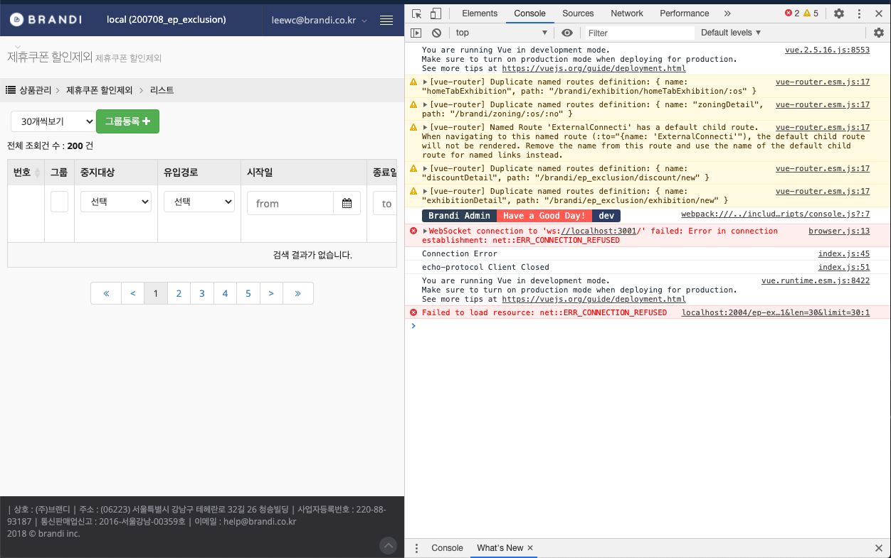
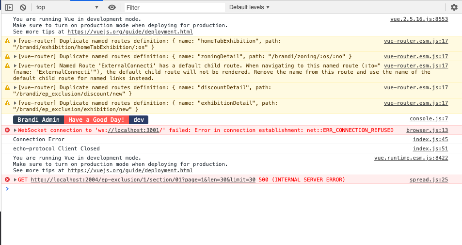
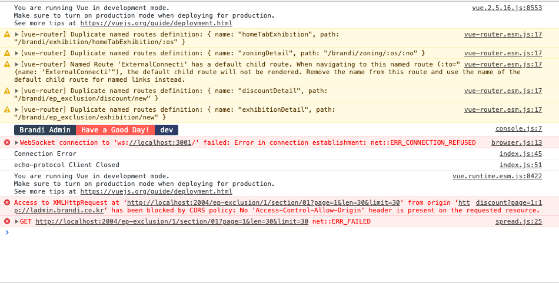

#### 👨🏻‍💻 오늘 무엇을 하였니?

- aws cli install

- python flask server open

- [데일리 리포트] : 

  [기타]

  > 네이버 EP 코드 파악

  

#### 👨🏻‍🎓 오늘 무엇을 배웠니?

- #### ISMS란?

  Information security management system의 약자이며 정보보호관리체계의 뜻을 가지고 있습니다.

  ISP업체, IDC, **100억 이상 또는 이용자 수 100만명 이상의 정보통신제공 서비스 사업자는 의무적으로 ISMS인증을 받아야 되며**, 2013년 의무화에 따라 기존 170여개에서 2014년 기준으로 금융, 관공서, 기업 등에서 377여개의 사이트가 ISMS인증을 받았습니다. 앞으로도 ISMS인증을 받는 기업들이 많아질 것으로 생각됩니다.

- #### API 수신을 못하는 문제

  `python3 flask_server.py` 후에 로컬 관리자 페이지를 들어가도 서버에러 표시가 나며 api data를 못 불러오는 상황이 생겼다.

  혹시 인터프리터가 문제인가 싶어서 인터프리터에 관련한 오류들을 모두 없앴다.

  **첫번째 오류**

  

  포트문제 : 웹에서 요청한 localhost:2004이고, 파이참에서 설정된 loclhost: 3001이어서 아래와 같은 명령어로 파이참에서 서버 로컬 포트를 변경해 주었다.

  `python3 flask_server.py -p 2004`로 바꾸어주었다.

  **두번째 오류**

  첫번째 오류로 포트를 알맞게 설정해 주었고 다음 오류가 다가왔다.

  

  웹에서 요청한 api 주소가 500 에러를 뿜고 있었다. 서버 쪽에서 api 경로 지정이 되었는지 확인하였고, 경로 지정이 되어있지 않았다. 해당 api를 새롭게 지정해주었다.

  **세번째 오류**

  두번째 오류로 경로를 알맞게 지정해 주었고 다음 오류가 다가왔다.

  

  여기서 막혔다.

#### 💆🏻‍♂️ 오늘 무엇을 느꼈니?

---

**📝 정리해야할 내용**

- 타이포라에 오류와 해결법을 무조건 적자
- 데이터베이스 : https://www.notion.so/Database-ac11be5fffa340a882e120cd45c84cf7
- 데이터구조
  - https://www.notion.so/Data-Structure-1-Intro-Array-Tuple-1340bc39eb62409c93f9d3bd03009a02
  - https://www.notion.so/Data-Structure-2-Set-Dictionary-Hash-163ec98aa0ad4669b73b705e265c2cf4
- VueX 
- Vue Created, watch 
- SQL vs NoSQL
- ACID
- MySQL Workbench
- MySQL 설치

**🔎 확인해야할 내용**

- 

**🤔질문해야할 내용**

- mysql, flask, json api 이 모든 과정이 어떻게 연동이 되는지