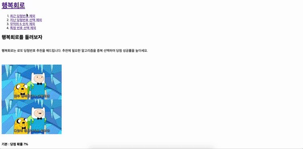

1. **🚶🏻‍♀️들어가며**

2. **📃 웹페이지**

# 🚶🏻‍♀️ 1. 들어가며

회사를 다니며 혼자 생활코딩을 보며 이것저것 따라하다 가장 처음 만들게 된 나의 웹 페이지이다. 가장 기본적이고 기초적인 html만으로 만든 페이지이다. 기간, 목표는 없었다. 그냥 무언가 개발하는 것이 재미있어 보여 무작정 따라 만들었었다. 나의 개발의 끝이 어떻게 될지 모르겠지만, 모두 이 페이지에서 시작하게 되었다.

링크, 이미지, 텍스트로 이루어진 웹페이지이다.

# 📃 2. [웹페이지]([https://one-iron.github.io/191230-personal-egoingWeb/%ED%96%89%EB%B3%B5%ED%9A%8C%EB%A1%9C.html](https://one-iron.github.io/191230-personal-egoingWeb/행복회로.html))

당시에 로또 추첨번호 웹 페이지를 만들고 싶었고, 그걸 기반으로 생활코딩 웹 페이지 만들기를 따라했었다. 내용은 그냥 생활코딩을 따라하면 재미가 없을 것 같아 위처럼 원하는 사진과 내용을 넣었다.