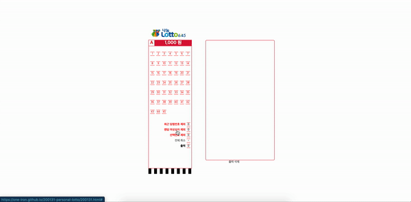

1. **🚶🏻‍♀️들어가며**

2. **🎲 웹페이지**

# 🚶🏻‍♀️ 1. 들어가며

나는 가끔씩 로또를 산다. 매번 자동으로 사기도 하지만, 내가 자체적으로 자동으로 번호를 추천해주는 웹 페이지를 만들어 보고싶어 만들게 되었다.

# 🎲 2. [웹페이지](https://one-iron.github.io/200131-personal-lotto/200131.html)

스타일은 로또 용지처럼 스타일링을 한 뒤 무작위 여섯숫자를 제외하거나, 선택한 숫자를 제외 하는 기능을 넣었다. 용지처럼 생긴 곳에 검정색으로 칠해지는 것이 해당 숫자를 제외한다는 뜻이고, 그 뒤에 출력이라는 텍스트를 클릭하면 검정색 숫자들을 제외한 무작위 6개의 숫자를 오른쪽에 표시해 준다.