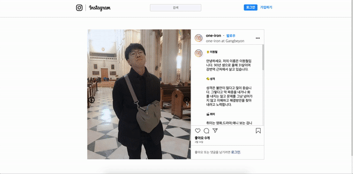

1. **🚶🏻‍♀️들어가며**

2. **👋 웹페이지**

# 🚶🏻‍♀️ 1. 들어가며

위코드 사전 스터디 모임의 과제 중 하나로 html과 css만으로 자신을 소개하는 웹 페이지 만드는 과제 결과 물이다.

# 👋  2. [웹페이지](https://one-iron.github.io/200218-wecode-webTask/web01.html)

css만 이용하여서 이미지 슬라이드를 구현하였다.