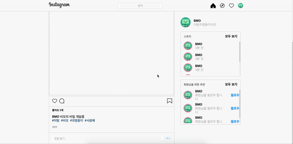

1. **🚶🏻‍♀️들어가며**
2. **🏖 로그인**
3. **🏝 메인화면**

# 🚶🏻‍♀️ 1. 들어가며

위코드 첫번째 클론이다. 결과물이 썩 좋지는 않다. 그래도 css를 조금 알아가는 과정이었다.

# 🏖  2. [로그인](https://one-iron.github.io/200401-wecode-westagram/login/westargram.html)

로그인 페이지에서는 아이디와 비밀번호 인풋창에 각각 글자가 1개 이상일 시에만 로그인 버튼이 활성화가 되며 색이 바뀌게 설정하였다.

# 🏝 3. [메인화면](https://one-iron.github.io/200401-wecode-westagram/main/main2.html)

메인 창에서는 덧글 달기 인풋창에 텍스트를 입력하고 엔터나 게시버튼을 클릭하면 덧글이 올라가게 만들어주었다.

**js 어떤 점을 배웠는지 적어보자**