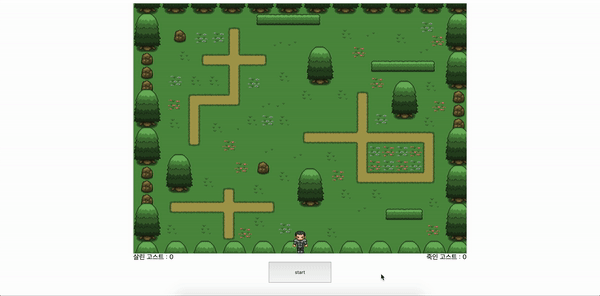

1. **🚶🏻‍♀️들어가며**
2. **👻 웹페이지**

# 🚶🏻‍♀️ 1. 들어가며

위코드 두번째 실습이다. 히어로라는 이미지를 키보드와 연동시켜 움직이게 한다. 일정한 시간마다 무작위 x값으로 내려오는 고스트와 히어로의 이미지가 중첩되면 고스트가 죽게 된다.

# 👻  2. [웹페이지](https://one-iron.github.io/200404-wecode-hero/main.html)

