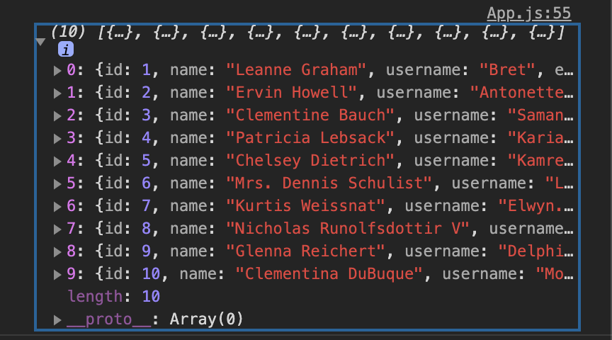

## 몬스터 카드란?

몬스터 카드란 몬스터의 이미지와 이름 해당 이메일들을 담고 있는 카드들을 나열한 페이지이다.

몬스터 카드과제를 받을 시에는 카드의 스타일링은 되있는 상태이다. 이 과제에서 내가 해야할 일은 간단하다.

1. **몬스터 데이터 호출**
2. **받은 데이터를 하위 컴포넌트에 전달**
3. **검색창에 단어 입력시 해당 문자 포함한 몬스터 카드 표시**


## 1️⃣ 몬스터 데이터 호출

### 상위 컴포넌트에서 데이터를 받자!

index.js를 제외한 가장 상위 컴포넌트인 app.js에 데이터를 받아야 한다. 그 곳에서 데이터를 받아 필요한 컴포넌트로 뿌려주어야 하므로 가장 상위에서 데이터를 간직하고 있는 것이 필요하다.


### ComponentDidMount()

아모른직다. 그렇다 다른 의미에서 아모른직다이다. 그래도 아는대로 지껄여보자.🤪

일반적으로 리액트를 작성 할 때에는 컴포넌트 디드마운트를 접한 적이 없다. 그냥 이론 상으로만 접해보았다. 하지만 몬스터 과정에서 배우고 습득한 느낌을 적어보자.

리액트 라이프 사이클링에서는 constructor 👉 render 과정이다. constructor에서 필요한 초기데이터를 세팅 해주고, render로 넘어가 return 내용들을 만들어서 페이지에 표현 해준다. 이 때에 return에는 대부분 Html 문법들로 페이지의 레이아웃과 스타일링이 들어가지는 데 만약 componentDidMount()가 추가가 된다면 life cycle은  constructor 👉 render 👉 componentDIdMount의 순으로 진행되어진다.

```
 추가적으로 정리해야할 개념들을 추가해야겠다. 너무 말도 안되는 개념을 가지고 있구나 원철아.
 
 우선 여기서 정확하게 설명을 못하는 것을 인정합니다.😢
 그러면 무엇을 정확히 설명하지 못하나를 따져 봅시다.
 
 1. react life cycling
 2. what is componentDidMount()
 3. why write fetch with api src in componentDidMOunt()
```

이 때 componentDidMout안에는 받아올 api주소를 넣는다. 그렇다면 어떻게 api주소를 호출하고 받아오고 뿌려주는 것 일까?


### Fetch()

```jsx
  componentDidMount() {
 		fetch("https://jsonplaceholder.typicode.com/users")
      .then((res) => res.json())
      .then((res) => this.setState({ monsters : res }))
  }
```

componentDidMount 함수 안에 불러올 주소를 fetch를 통해 불러오면 된다. 🤗

`fetch("https://jsonplaceholder.typicode.com/users")` 

fetch안에는 해당 api주소를 작성한다.

`.then((res) => res.json())` 

then은 말 그대로 앞의 내용이 실행되면 다음 내용을 실행하라는 뜻 이다. 여기에서는 api주소를 통해 데이터를 받아오면 인자로 데이터들을 res로 매개변수를 써주고, 그 데이터들을 javascript로 변환하라는 문장이다.

`.then((res) => this.setState({ monsters : res })`

다시 then을 사용해 해당 데이터를 현 컴포넌트 state값으로 전달해주는 내용이다.

저 3줄의 코드를 우리말로 변환하면 이렇다. `api주소에 있는 데이터를 가져오고, 그 데이터를 javascript로 바꿔주고, 그 js로 바꾼 데이터들을 state값으로 넘겨줘.`


## 2️⃣ 받은 데이터를 하위 컴포넌트에 전달하기

자 이제 우리는 state값에 api에서 받아온 몬스터들의 다양한 정보들을 가지고 있다. 이 것을 이제 잘 활용해야 한다. 무엇을 할까? 받아온 몬스터의 수 만큼 카드를 만들어 보고 싶다. 

그러기 전에 this.state에 저장해 놓은 다시 말해 api에서 받아온 정보들이 어떤 형태인지 확인해 볼 필요가 있다. 그래야지 정확히 접근해서 데이터를 재가공을 할 수 있다.



**위의 그림처럼 api호출을 받아온 데이터의 형식은 배열안에 객체가 들어있다.**


자 여기까지는 api호출에서 받아온 데이터들 state값에 넣어두었다. 그리고 방금 전에 그 state값에 넣어둔 데이터들의 형태를 console.log를 하니 객체인 것 까지도 확인했다.  이제는 이 데이터를 cardlist라는 하위 컴포넌트에 데이터를 넘겨준다.

이 때에, 하위 컴포넌트에 필요한 데이터만 객체에서 뽑아서 전해준다. 사진에는 쓰진 않았지만 상위 컴포넌트에는 아마 cardlist컴포넌트를 적고 속성값으로 state값을 전해주었을 것 이다.

그리고 cardlist에서 props를 받아서 map함수를 통해 배열안에 있는 모든 데이터를 cardlist 스타일링에 넣어주면 된다.


map을 통해 배열안에 있는 요소만큼 받아오고, 그 갯수만큼 map 함수 아래에 있는 html 형식이 작성된다. 이 때에 카드리스트는 전체 카드리스트들 스타일링 하는 컴포넌트이기 때문에 각 하나의 카드를 관리하는 card 컴포넌트에 해당 props를 다시 한번 건내준다.


자 이제 card컴포넌트 까지 왔다. 이 곳에서 카드 개당의 스타일링을 해준다. 이때 내가 실수한 부분은 바로 이미지 src를 적는 곳에서 조금 해맸었다. src는 문자열 형태이지만 중간에는 가져온 변수값을 넣어주어야 하니 보간법을 적용해서 위 처럼 작성하면 된다.


searchbox는 인풋창을 담고 있는 컴포넌트이다. 이 곳에 onchange 이벤트가 발생하면 인풋값을 this.state 값을 변경하는 함수를 넘겨준다.


그리고 드디어 searchbox에서 handlchange함수를 넘겨 받았다. 그리고 인풋에 직접 onchange이벤트와 발생시 해당 함수를 실행하게 작성해준다.


## 3️⃣ 검색창에 단어 입력시 해당 문자 포함한 몬스터 카드 표시


