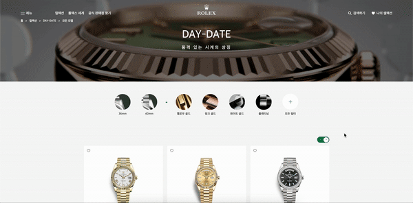
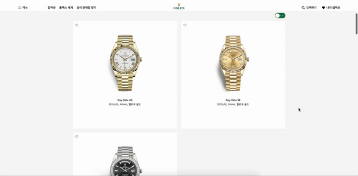
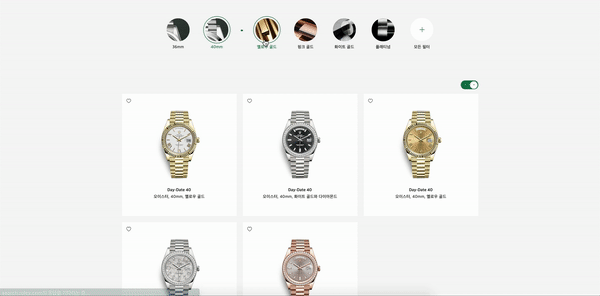

-----

1. **들어가며**
2. **모두 보기 페이지**
3. **네브 컴포넌트**
4. **상세페이지**

---

# 🚶🏻‍♀️ 1. 들어가며

위코드 1차 프로젝트를 마치며 본 포스트에는 필자가 만들었던 페이지에 대한 기능을 설명하려 한다. 또한, `들어가며` 문단에서는 프로젝트의 개요를 적어보려 한다. 필자가 참여한 프로젝트의 개요는 아래와 같다.

- 기간 : 9일간 (4월23일 ~ 5월1일)
- 목표 : [롤렉스 공식 홈페이지](https://www.rolex.com/ko)
  - 메인페이지, 로그인/회원가입 페이지, 설정하기 페이지, 모두보기 페이지, 시계 상세 페이지
- 인원 : 백엔(정인님, 희진님, 예은님) / 프엔(지희님, 민석님 원철님)
- **담당 : 모두보기 페이지, 네브 컴포넌트, 시계 상세페이지**
- 여담 : 원래는 [비마이펫](https://mypetlife.co.kr/map/)이라는 애견동반가능 장소 정보제공을 해주는 곳을 클론할 예정이였지만, 4일 진행중 백엔드에서 클론 중 이상하게 시간이 오래 걸리는 상황과 프엔에서는 4일만에 대략적인 스타일링이 완료되는 사태가 발생되고 있었다.😅 그만큼 서버가 불안하고, 그만큼 디자인이 간단하다는 반증이기도 했었다. 하지만 4일차 때, **위워크 와이파이 아이피가 간헐적으로 차단**되었다.☹️ 첫 차단에는 1~2시간 뒤에 다시 접속이 가능했고, 다시 접속이 가능해지다가 다시 차단이 되어었다.😤 그렇게 백엔과 프엔은 상의 끝에 새로운 홈페이지를 클론하기로 결정하였고 **5일차에 새롭게 롤렉스 공식 홈페이지 클론을 시작**했다. 여담의 여담으로 비마이펫은 사실 덧글 기능도, 좋아요 기능도 작동이 제대로 되지 않고 있었고 이 외에도 수많은 문제가 있었다.

# 👫🏻 2. 모두보기 페이지

**주요기능 : 상품 카드 나열, 레이아웃 변경 토글 버튼, 필터링 기능**

모두보기 페이지는 모든 시계 상품이 카드 형식으로 나열된 페이지이며, 토글 버튼을 이용하여 카드 레이아웃을 변경할 수 있다. 또한, 카테고리 아이콘을 누르면 해당 상품만 필터링 해주는 기능도 있다. 

### 2-1 상품 카드 나열

**기능 설명 : 백엔드에서 받아온 시계 데이터들을 나열해 준다.**

컴포넌트 경로 : FindRolex / ProductList / ProductCard

- **FindRolex component**
  - Fetch함수 이용 전체 시계 데이터를 state에 저장 후, ProductList component로 전달
- **ProductList component**
  - 이 곳은 카드들이 담겨질 container이므로, 시계들이 담길 틀의 레이아웃을 그리드로 디자인 하였다.
  - 그리드로 디자인된 부모 div아래 자식 div로 ProductCard를 생성하였다.
  - render위에서 map함수를 이용하여 ProductCard에 필요한 데이터들을 props로 전달하였다.
- **ProductCard**
  - 이 곳은 카들 하나하나가 담겨지는 곳으로 카드 하나를 디자인 하였다.
  - 디자인을 할때 props를 받아온 데이터를 이용하였다.

### 2-2 레이아웃 변경 토글 버튼

**기능 설명 : 토글 버튼을 누르면 나열된 상품의 레이아웃이 3x7에서 2x10으로 변경된다.**

컴포넌트 경로 : FindRolex / ProductLsit / GridChange

- **FindRolex component**
  - Fetch함수 이용 전체 시계 데이터를 state에 저장 후, ProductList component로 전달
- **ProductList component**
  - 이 곳은 토글버튼의 상위 컴포넌트이다.
  - 토글 버튼이 눌렸는지 확인할 수 있게 boolean값을 넣어 토글버튼의 state값을 만들어 주었다.
  - 토글 버튼이 눌렸을 때, 토글 버튼 state값을 변경해주는 함수를 만들어 주었다.
  - 이 2가지를 GridChange 컴포넌트로 전달하였다.
- **GridChange component**
  - 이 곳은 토글버튼이 있는 곳 이다. 
  - 토글 버튼 태그에 onClick 이벤트를 생성하였다. 전달받은 state 변경 함수를 onClick 이벤트가 실행되면 실행되게 하였다.
  - 토글버튼의 디자인도 이 곳에서 이루어진다. 이 때, 토글버튼의 className을 전달받은 boolean으로 설정된 state값에 따라 className을 부여하게 하였다. (눌러졌을 때는 이런 모양 : 안눌러졌을 때는 이런 모양)

### 2-3 필터링

**기능 설명 : 사이즈 카테고리와, 소재 카테고리를 중복으로 클릭이 가능하고, 클릭된 카테고리의 상품들만 나열하게 해준다. 클릭된 카테고리 아이콘은 스타일링이 달라진다.**

컴포넌트 경로 : FindRolex / FilterCenter / CategoryIcon

- **FindRolex component**
  -  filterChangeHandler함수를 생성했다. 이 함수는 카테고리 아이콘이 클릭할 경우 해당 id값을 받아 state를 변경하는 함수이다.
  - componentDidMount 함수를 생성했다. 이 함수에서는 위  filterChangeHandler함수가 setState 발동하였을 때 실행되어진다.
  - componentDidMount 함수에서는  filterChangeHandler함수에서 변경된 state 카테고리 아이콘 id값을 가져와 queryString을 만드는 조건문이 담겨져있다.
  - componentDidMount 함수에서 queryString이 완성되면 fetch함수에 넣어 데이터를 받게 하였다.
- **FilterCenter component**
  - 이 곳은 필터 카테고리 아이콘들이 담겨질 영역이여서, 해당 영역의 디자인을 flex로 해주었다.
  - 카테고리 크기와 소재 중복 선택을 위해 해당 데이터가 들어있는 2개의 배열을 state값에 지정하였다.
  - 카테고리 아이콘이 선택되었는지 여부를 알 수 있는 boolean이 담겨진 state값을 만들어 주었다. 또 해당 state값들을 클릭할 경우 반대 boolean으로 변경되는 함수도 만들었다.
  - 배열로 되어있는 2개의 state값을 map 함수를 이용하여 컴포넌트를 만들었다. 이 때 필요한 데이터들과 방금 만든 클릭여부 state값과 함수도 전달하였다.
- **CategoryIcon**
  - 이 곳은 카테고리 아이콘 하나하나의 영역이여서, 카테고리 아이콘 디자인을 해주었다.
  - 전달 받은 데이터들도 각각의 위치에 배치시켜 디자인을 해주었다.
  - onClick이벤트도 추가하여 전달받은 함수를 실행하게 했다.
  - 전달 받은 클릭여부 stater값을 통해 className 조건문을 달아주었고, 조건문 안에는 클릭했을 경우의 디자인과 클릭하지 않았을 경우의 className을 적어주었다.

# 🎹 3. 네브 컴포넌트

**주요기능 : 스크롤 반응 네브, 모달, 메뉴 모달, 셀렉션 모달**

네브 컴포넌트는 모든 페이지에 있는 컴포넌트로, 사용자가 용이하게 원하는 페이지로 이동 할 수 있게 하는 컴포넌트이다.

### 3-1 스크롤 반응 네브

**기능 설명  : 스크롤에 반응하는 네브의 스타일은 총 3가지이다. 스크롤이 탑에 위치할 때, 스크롤이 내려갈 때, 스크롤이 올라갈 때 이렇게 3가지이다.** 

컴포넌트 경로 : TopNav

- TopNav
  - componentDidMount함수에 addEvnetListener를 생성했다. scroll을 감지하고, handScroll이라는 함수를 추가해주었다.
  - handelScroll 함수에서는 인자 값으로 e를 받는다.
  - handelScroll 구현문에서는 setState를 만들어 scroll이 탑에 위치한지, 내려가는지, 올라가는지를 상태값으로 만들어 준다.(setState에 인자값을 넣어주어, 현재 state값을 가져오고 현재 스크롤 위치와 비교해준다.)
  - 네브의 className을 scroll state를 바라보게 하고, 3가지의 scss 디자인을 해준다.

### 3-2 모달

**기능 설명 : 네브에서 메뉴와 셀렉션을 누르게 되면, 해당 내용의 모달 창이 생성된다.**

컴포넌트 경로 : TopNav

- TopNav
  - return 아래에 디자인된 메뉴와 셀력션의 모달 컴포넌트를 추가한다.
  - className은 모두 삼항연산자로 클릭됬을 때 boolean값으로 보여지고, 가려지는 2가지 className을 부여해준다.
  - 모달 컴포넌트가 바라볼 boolean state값을 만들어준다.
  - 메뉴와 셀력션 텍스트 영역에 onClick이벤트를 생성하고, 해당 state값을 setState하는 함수를 만들어 넣어준다.

### 3-3 메뉴 모달

**기능 설명 : 네브에 있는 메뉴 모달로 상품 슬라이드 이미지를 볼 수 있으며, 다른 컴포넌트로 연결해주는 링크 기능이 있다.**

컴포넌트 경로 : TopNav / InMenu / CollectionDisplay / NavCollection

- TopNav
  - InMenu 컴포넌트를 만들어주고 className은 클릭 여부 state를 삼항연산자를 이용해서 바라보게 해주었다.
  - 링크 연결에 필요한 withRouter을 import 해주었다.
  - Link태그를 쓰지 않고 goTo함수를 이용하였고, 연결될 해당 텍스틑 영역에 모두 onClick에 goTo함수를 연결하여 해당 컴포넌트 끝 주소를 인자로 넘겨주었다. 그리고 연결된 후에 모달 창은 종료되도록 모달 클릭여부 state변경을 해주는 함수도 같이 실행하도록 넣어주었다.`This.props.history.push(해당컴포넌트주소)`
- InMenu
  - 슬라이드 이미지가 들어갈 영역 div를 생성하고 NavColeection component를 추가했다.
- CollectionDisplay
  - 이 곳은 슬라이드 이미지의 큰 틀이 디자인되는 곳 이다.
  - 스크롤 커스텀에 필요한 react-scrollbars-custom을 설치했다.
  - componentDidMount를 생성하고 fectch 함수를 이용해 슬라이드 이미지에 필요한 이미지와 텍스트들을 state값에 저장해주었다.
  - NavCollection 컴포넌트에 해당 데이터들을 전달해주었다.
- NavCollection
  - 이 곳은 슬라이드 이미지 하나의 카드가 디자인되는 곳 이다.
  - 전달받은 데이터를 배치하여 카드를 디자인 해주었다.

### 3-4 셀렉션 모달