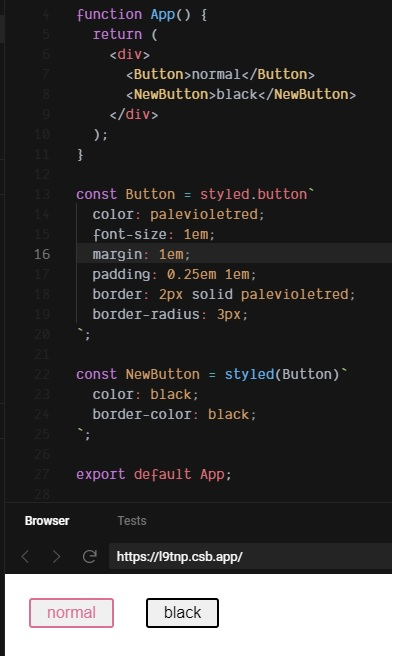

1. **⚙️ setting**

2. **🖼 using**
3. **🤸‍♂️ extend**
4. **🐧 nesting**


# 1. ⚙️ setting

**npm install**

```
npm install --save styled-components
```


**react import**

```jsx
import React from 'react';
import styled from 'styled-components';
```


# 2. 🖼 using


### **general using**

```jsx
import React, { useState, createContext } from "react";
import styled from "styled-components";
import Dsecond from "./DSecond";

export const CountContext = createContext();

const DFirst = () => {
  const [count, setCount] = useState(0);
  return (
    <Wrap
      onMouseEnter={() => {
        setCount(count + 1);
      }}
    >
      <CountContext.Provider value={[count, setCount]}>
        <Dsecond />
      </CountContext.Provider>
    </Wrap>
  );
};

export default DFirst;

const Wrap = styled.div`
  width: 200px;
  margin: 100px;
  padding: 30px;
  background-color: pink;
`;
```

위 예시는 [준영](https://velog.io/@jjunn0)님께서 만드신 colorHunter의 오픈소스를 받은 내용이다. 준영님께서는 함수형 컴포넌트를 이용하여 wrap이라는 최상위 태그로 감싸주고 wrap태그를 아래에 styled.div로 스타일을 한 모습이다.

기존에 컴포넌트를 이용할 때에는 js파일을 만들어 import를 해주어야 했는데, styled component는 위 예시처럼 즉시 생성과 동시에 스타일을 해 줄 수 있다. 즉, js파일, scss파일의 생성이 필요없다. 또한, styled components는 해당 컴포넌트 내부에 정의하기 때문이다. CSS의 단점이었던 전역에서 중복될일이 없어졌다.

**여기서 `const Wrap`은 컴포넌트명을 생성하고, 그 뒤에 `= styled. div`는 생성한 컴포넌트가 가지고 있는 div에 대한 스타일을 지정한다는 뜻 이다. div가 아니라 button input등 다른 태그들이 들어 올 수 잇다.(ex : const Wrap = styled.input // or const Wrap = styled.button)**


### **global using**

```jsx
import { createGlobalStyle } from "styled-components";

//글로벌 스타일
export const GlobalStyle = createGlobalStyle`

body {
	line-height: 1;
}

`;
```

이렇게 config.js파일 같은 곳에서 글로벌 전역 스타일을 지정 한 후, routes.js같이 모든 컴포넌트가 담겨지는 최상의 파일에 아래와 같이 import를 하면 된다.

```jsx
import { GlobalStyle } from "./Config";
```


### Switch Tag

```jsx
const Button = styled.button`
  color: palevioletred;
  font-size: 1em;
  margin: 1em;
  padding: 0.25em 1em;
  border: 2px solid palevioletred;
  border-radius: 3px;
`;

const NewAnchor = styled(Button.withComponent("a"))``;
```

이럴 일은 없겠지만, 위쪽 button이라는 컴포넌트에서 button태그의 스타일을 지정해주었다. 그런데 newAnchor 컴포넌트에서 a태그의 button태그 스타일을 가져오고 싶으면 **withComponent** 메소드를 위 처럼 사용해주면 된다.


# 3. 🤸‍♂️ extend



`const NewButton = styled(Button)`은 newbutton이라는 components에 button의 스타일 값을 상속시켜주는 것 이다.


# 4. 🐧 Nesting

이 아래에서 부터는 [선주님의 블로그](https://www.notion.so/5da80ee9c0e54a58b1aad36f5fc8f76c?v=1beef789fc0d4dba970f74ca5be823bf&p=eb72d4ec0a30498e957704acdbb8bb50)를 탐방하다 알게 된 Styled Component의 Nesting 기능들이다. 예제 코드들이 워낙 무엇을 표현하고자 하는것이 명확하여 좋다.


### 부모와 자식 Nesting

```jsx
const ChildDiv = styled.div`
  margin: 30px 30px;
`;

const ParentDiv = styled.div`
  margin-bottom: 30px;
  
  ${ChildDiv} {
    margin: 20px 0;
  }
`;
```

이미 지정되어있는 ChildDiv라는 컴포넌트를 ParentDiv에서 사용하면서 해당 스타일을 변경하려면 위와 같이 ParentDiv 스타일 컴포넌트 안에 `$(){}`를 사용하면 되겠다.


### 부모와 자식 Hover

```jsx
const StyledDiv = styled.div`
  margin-bottom: 30px;
  
  &:hover {
    background-color: black
  }
`;
```

스타일드 컴포넌트 안에서 hover 기능 역시 사용이가능하다. 위와같은 방식으로 상위 컴포넌트의 Hover시, 하위에 있는 컴포넌트의 이펙트효과를 줄 수 있다.

예를들어 부모 컴포넌트에 마우스가 hover될시, 자식 컴포넌트의 색깔일 변경을 아래와 같이 할 수 있다.

```jsx
const ParentDiv = styled.div`
	&:hover {
	$(ChildDiv){
		color: pink;
	}
	}
`;
```


### Props와 StyledComponent

```jsx

const ParantDiv = styled.div`
  margin-bottom:30px;
  
  ${props => props.black &&`
    background-color: black;
  `};
`;

<ParentDiv black>
  Is it black?
</ParentDiv>

<ParentDiv>
  It is not black.
</ParentDiv>
```


```jsx
const StyledComponent = styled.div`
  margin-bottom: ${props => props.Row === 1 ? props.FontColor : '20px'};
`;


<StyledComponent Row="1" FontColor="red">
  RED BOTTOM IS 10!
</StyledComponent>
```

