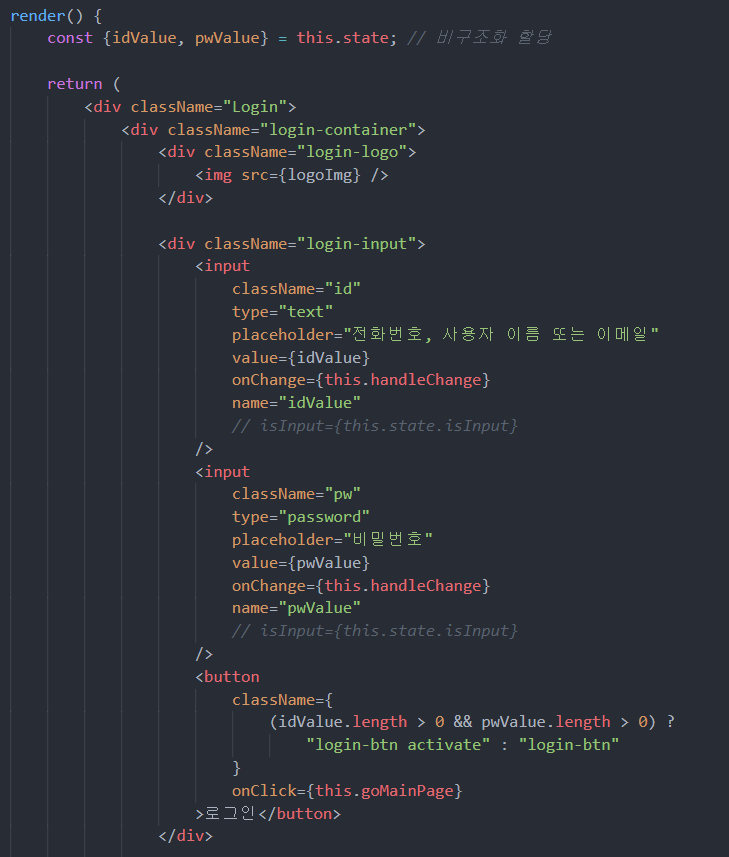

## Destructuring assignment (구조 분해 할당)


### 구조 분해 할당 무엇?


> Destructuring : ~의 구조를 파괴하다.(타동사)
>
> Assignment : 배정


`Destructuring assignment (구조 분해 할당)` 어학사전의 뜻으로 유츄하자면 기존의 구조를 분해하여, 새롭게 할당하는 뜻을 가르키는 것 같다. 그리고 해당 언어를 우리나라말로 번역한 명칭은 `구조 분해 할당` 이다. 비구조화 할당이라는 명칭도 쓰이지만, 그래도 나름 언어학자였던 필자는 `구조 분해 할당` 이 가장 적절하다고 본다. 😎~~(응 문과 경력 무쓸모)~~

**그렇다면 구조 분해 할당이란 도대체 어떤 구조를 분해해서, 어떤 것을 할당할까?**

우선 필자가 세션을 통해 배운 지식과 검색을 통해 알게된 위 질문에 대한 답변은 array, object에서의 data들을 가져와 새로운 변수로 할당하는 것이다. **즉 구조 분해 할당이란 배열, 객체를 분해하여 안에 있는 값을 변수로 할당 할 수 있다는 것 이다.**(~~십분 멋있다.~~)

이렇게 대략적인 의미를 곱씹어 보니 비구조화 할당 보다는 구조 분해 할당의 명칭이 적절한 것 같다. 비구조화 할당은 할당된 변수 자체를 표현 한 것 같다. 할당된 데이터 자체는 구조화가 아닌 것을 뜻한다. 비구조화라는 단어는 할당의 수식어인 셈이다. 구조 분해 할당은 좀 더 이 명칭이 생겨난 전체적인 흐름을 담고 있다. 둘다 같지만, 비구조화 할당은 현재 상태를 뜻하고, 구조 분해 할당은 전체 과정을 담고 있는 것 이다. 객체나 배열의 구조였던 데이터를 분해하여 가져와 새롭게 할당 하는 뜻인 부조 군해 할당이 좀 더 적절치 않나 싶다.🙂(~~네, 다음 문과 자존심 들어오세요.~~)

**즉 구조 분해 할당은 객체나 배열에서의 데이터를 변수로 활용이 가능 한 것을 뜻 한다.**


### 배열과 객체의 구조 분해 할당


- **배열의 구조 분해 할당**

  ```javascript
  [a1, a2, ...rest_a] = [1, 2, 3, 4, 5, 6, 7, 8, 9];
  console.log(a1); // 1
  console.log(a2); // 2
  console.log(rest_a); // [3, 4, 5, 6, 7, 8, 9]
  ```

  위 처럼 간단한 개념으로도 사용할 수 있다. 전개연산자에 대해서는 나중에 포스팅을 해보자. 아직 쓰기에는 깐깐한 친구일 것 같다.

  

- **객체의 구조 분해 할당**

  ```javascript
  var { a1, a2, ...rest_a } = { a1 : 10, a2 : 20, a3 : 30, a4 : 40 };
  console.log(a1); // 10
  console.log(a2); // 20
  console.log(rest_a); // { a3: 30, a4: 40 }
  ```

  객체 구조 분해 할당도 배열의 구조 분해 할당과 크게 다른 것은 없다.

  

- **구조 분해 할당의 유용한 문법**

  ```javascript
  const object = { a: 1, b: 2 };
  
  const { a, b } = object;
  
  console.log(a); // 1
  console.log(b); // 2
  ```

  위의 문법처럼 객체 안에 있는 키값 자체를 바로 변수로 지정하여 사용 할 수 있다. **즉, 내가 원하는 객체의 데이터만 가져와 변수를 지정 할 수 있다는 뜻 이다.** 이 얼마나 간편하단 말인가.😛 알면 알 수록 재미있는 언어이다.


### 리액트 인스타 클론 중의 구조 분해 할당 사용



**매번 `this.state.idValue` 혹은 `this.state.pwValue` 를  작성하여 간단하게 바로 `idValue` 혹은 `pwValue`로 사용 할 수 있게 되었다.** 위 이미지의 코드 하단에 버튼 태그를 본다면 조건문에서 사용한 예제를 볼 수 있게 된다.

그리고 이 구조분해할당 개념과 다음 포스트에 정리할 계산된 속성명을 통해 더 깔끔하고 간편한 코드를 짤 수 있게 된다. **다음 포스트에는 `계산된 속성명`을 정리해 보겠습니다.**