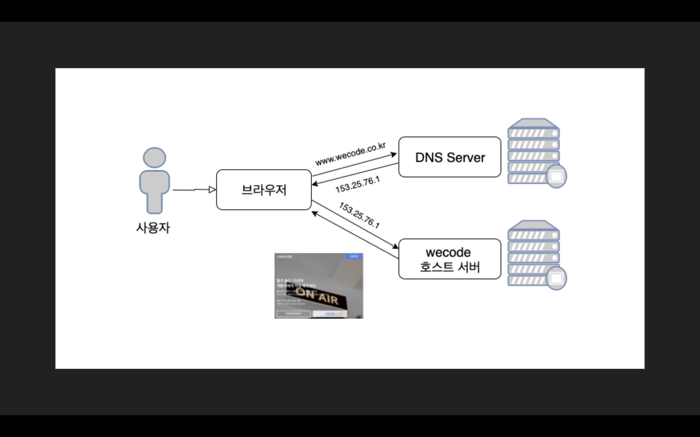

사용자가 보기에는 웹 주소에 해당 홈페이지 주소를 치면 홈페이지를 자신의 컴퓨터에 불러 와 사용할 수 있다. 이렇게 보면 웹의 동작은 2가지이다. 사용자가 주소를 입력하고, 컴퓨터가 해당 홈페이지를 알아서 불러온다. 뼈 속을 넘어 세포 속 하나 하나 문과출신인 나는 저렇게 생각한다. (호호 🤭 정말 못났다)

중국 고대 시를 살펴 볼 때에는 작가는 어떤 사람인지, 어떤 시대, 어떤 나라 그리고 어떤 문파인지를 고려해서 어떤 상황에서 그 시를 작성했는지를 알고 시의 뜻을 파악하게 된다. (사랑해요 😘 도연명)

웹이 무엇인지와 웹의 동작을 하나하나 알아보도록 해보자.

---

### 🕸 웹?


웹은 "World Wide Web"의 줄임말이다. 첫 글자들을 따서 "WWW"라고 부르기도 한다. "world"와 "wide"는 어느정도 이해하겠지만 "web"은 정확히 무슨 뜻인지, 왜 들어갔는지가 조금 궁금해졌다.

**"web"은 사전적 으미로 "거미줄", "거미집", "망"이라는 뜻이 있다.** 

1990년 웹의 창시자인 팀 버너스리(Tim Bernenrs-Lee)가 처음 웹을 만들 었을 때 "월드 와이드 웹" 대신 생각했던 이름들이 있었다. 

- Information mesh (정보그물망)
- the information mine || mine of information(정보의 보고)

이름들은 가만 보고 있으면 모두 연결되어 있는 느낌이 든다. 정말 마치 그물망과 거미집처럼 말이다. 링크에 링크를 연결하면 이어지는 모양새가 마치 망과 같다. 이렇게 보니 웹이라는 이름이 정말 잘 맞는 것 같다. 😀 이렇게 복잡하게 보이는 웹은 어떤 방법과 절차로 간편하게 작동하는지도 조금 궁금해진다.


---


우선 우리가 언제 홈페이지를 입력해도 24시간 내내 반응을 해준다. 아마도 사람이 아닌 컴퓨터가 우리의 요청에 응답해주는 것 같다. 홈페이지를 작성한 사람이 쉬지 않는 서버를 만들어서 쉬지않고 응답해 주는 서버를 호스트 서버라고 한다. 하지만 대부분의 홈페이지는 직접 호스트 서버를 관리 하지 않고, 호스팅 서비스를 해주는 곳을 이용한다.

아무튼 사용자에게 언제나 즉시 응답을 해주는 것을 바로 호스팅이라고 한다. 


### 🏪 호스팅(web hosting service)

웹 페이지를 구성하는 html, css, js파일들을 항상 가지고 있다가, 사람들이 웹페이지로 접속하면 파일들로 구성된 웹 페이지를 보내주는 것 이다. 이렇게 항상 파일들을 가지고 있는 것이 호스팅한다는 뜻 이다. 유명한 호스트 서버로는 AWS, cafe24 등 호스팅 서비스를 하는 서버들은 많이 있다. 이러한 곳은 24시간 쉬지않고 웹페이지 파일들을 보관을 하다가 사용자에게 바로바로 응답해주는 서비스를 해주는 곳 이다.


**그렇다면 현재 내가 알아온 웹 동작의 구조를 간략하게 이모찌로 표기하면 이렇게 될 것 같다.**

1. 🧑‍🎤(네이버 : 나 퇴근할게 호스트야 내 파일 잘 가지고 응답해줘) ⇢ 🗄(호스트서버 : 네 살펴가십쇼)
2. 🧑‍💻(나 : 네이버 홈페이지 볼래) ⇢ 🗄(호스트서버 : 응 잠만 네이버 html, css, js파일 찾고 있음)
3. 🗄(호스트서버 : 찾았다 옜다) ⇢ 🧑‍💻(나 : 아오 개느려 속터져 무튼 감사 😁)
4. 🗄(호스트 : 인성 무엇? 🤬)


---


하지만 우리가 치는 naver.com은 사실 진정한 네이버의 주소가 아니다. 우리가 현재 알고 있는 모든 문자열로 되어있는 웹 주소는 사실 진짜 주소가 아니라 별칭이라고 볼 수 있다. 이러한 웹 각자의 진정한 주소가 바로 IP주소 이다.

우리 스마트폰에 저장되어 있는 지인의 이름 혹은 그 사람의 별명들이 바로 도메인 주소이고, 그 사람들의 전화번호가 IP주소라 생각하면 되겠다.


### 💻 IP주소

IP주소는 인터넷으로 통신하는 각 컴퓨터, 스마트폰, 통신 매개체 전부에 부여된 중복되지 않은 고유한 값이다.

```
IPv4
172.16.254.1
32 bits 4bytes
```


### 🧑‍💻 Domain(Domain name)

IP주소마다 문자열로 되어있는 도메인 주소가 매칭되어 있다. 그래서 우리는 네이버 주소를 문자열로 기억은 하지만, IP주소를 외우지는 않지만, 우리가 알고 있는 모든 도메인주소에는 그 해당의 원래 주소인 IP주소를 가지고 있다.

Protocol://subdomain.domain.top levle domain(TLD).port/path?query string(parameter)  


### 📡 DNS(Domain Name System)

DNS는 사람들이 도메인 주소 즉 문자열로 되어있는 주소를 입력하면, DNS서버에서 해당 도메인 주소를 받아 원래의 IP주소로 변화하여 사용자가 원하는 웹사이트를 볼수 있게 응답해준다. 도메인, 아이피 주소 필터기라 보면 좋을 것 같다.


**여기까지 와보니 또 동작들이 더 많아진 것 같다. 다시한번 이모찌로 동작 구조를 표현해 봐야겠다.**

1. 🧑‍🎤(네이버 : 나 퇴근할게 호스트야 내 파일 잘 가지고 응답해줘) ⇢ 🗄(호스트서버 : 네 살펴가십쇼)
2. 🧑‍💻(나 : 네이버 홈페이지 볼래) ⇢ 📡(DNS : 네이버? 뒤적뒤적 여깄다 네이버 아이피 주소)
3. 📡(DNS : 여기 네이버 아이피 주소 여기로 찾아가봐) ⇢ 💻 (내 컴퓨터 : 응 고마워 DNS형)
4. 💻 (내 컴퓨터 : 호형호제 하는 호형님 이 아이피 주소 웹 좀 보내줘) ⇢ 🗄(호스트서버 : 고생이 많다. 이 아이피 주소 html, css, js 파일이.. 뒤적뒤적 여깄다 옜다!)
5. 💻 (내 컴퓨터 : 여기요 짜잔) ⇢ 🧑‍💻(나 : 아오 개느려 속터져 무튼 감사 😁)
6. 🗄📡💻 (다같이 : 인성 무엇? 🤬)

---

  